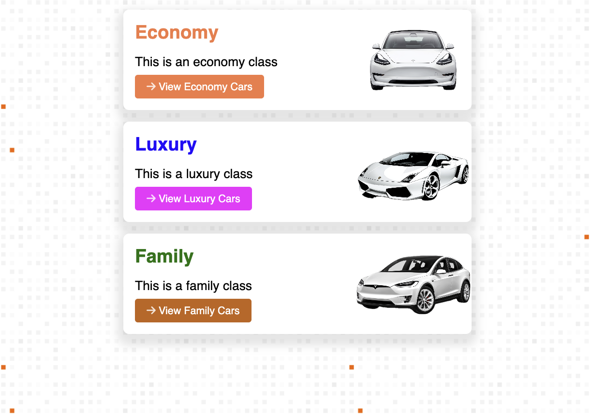

# Car Display Cards
In this project, you’ll build a visually appealing layout featuring different car classes: Economy, Luxury, and Family. Each card will have unique styling, including a heading, a brief description, and a link button. This project will help you practice HTML5 and CSS3 skills while designing an interactive and modern layout.

## 🗒️ How to Start This Project?
1. **Ensure You Have a GitHub Account**
   If you don’t have one, sign up at [https://github.com](https://github.com/).
2. Navigate to the project template
   - Create a repository from the template to your account
   - Open the project with a new codespace
   - Once you did it once you can open the codespace that was previously created.


## 📁 Project Structure
The project comes with a predefined folder structure and assets, so you can focus on building the layout. Here is the folder structure:
```ASCII
project-name
├── assets
│   ├── economic-car.png
│   ├── family-car.png
│   ├── luxury-car.png
│   └── pattern.png
├── css
│   └── style.css
└── index.html
```
All images (car images and background pattern) are provided in the assets folder and can be used directly in your project.

## 📝 Requirements:

#### Create the HTML and CSS3 needed to replicate this page with 3 cards.


### Layout and Design:
1. Create the HTML and CSS for a card layout featuring three classes of cars: Economy, Luxury, and Family.

2.	Each card should contain:
    - A heading for the class name (e.g., “Economy”).
    - A description paragraph.
    - A button link to view more cars in that class.
    - Apply a background image pattern for the entire page to give it a modern feel.
    - Each card should display an image on the right side as part of the background.

### Styling:
- Reset margins and padding at the beginning and apply box-sizing: border-box to simplify layout management.
- Use CSS3 to style the cards with rounded corners, shadows, and a centered layout.
- Custom Font: Add a font from Google Fonts to enhance typography.
- Each heading should have a unique color.
- Each button should have a distinct color that corresponds to the car class (e.g., orange for Economy, purple for Luxury, and green for Family).
- Add icons or small graphical elements for added visual appeal.


## 📐 Card Structure:
- **Heading** – Large and bold, with unique colors for each car class.
- **Paragraph** – Brief description of each class.
- **Button Link** – Styled button for viewing more cars, with unique colors.

#### **Adding Google Fonts**

1.	Visit [Google Fonts](https://fonts.google.com/).
2.	Select a font you like.
3.	Click on **'Get Font'**.
4.	Click on the **'Embed'** tab and copy the `<link>` tag.
5.	Paste the `<link>` tag into the `<head>` section of your HTML file.

### **🤔 What to Do If You Are Stuck?**

#### **Review Fundamentals:**

- Revisit your notes or resources on HTML5 and CSS3 basics.

#### **Ask for Help:**

- Don’t hesitate to reach out to your instructor or peers for assistance.


## 📚 Fundamentals Covered

This exercise covers the following fundamentals:

1.	HTML5 Structure
2.	CSS Reset Techniques
3.	Using Google Fonts
4.	CSS Styling for Cards
5.	Background Images and Patterns
6.	Simple Layout
7.	Responsive Design Principles

✅ Submission Checklist

- [ ]  All required card elements (heading, paragraph, button, image) are present.
- [ ]  HTML is well-structured with semantic tags.
- [ ]  CSS properly styles the cards with rounded corners, shadows, and background images.
- [ ]  Custom font and unique colors for each card class.
- [ ]  Layout is responsive and looks good on various devices.
- [ ]  Code is clean, well-commented, and organized.
- [ ]  Tested in multiple browsers for compatibility.